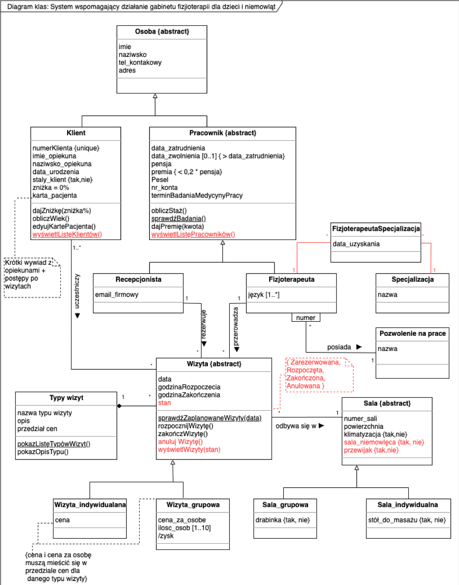

# MAS_Project - System wspomagający działanie gabinetu fizjoterapii dla dzieci i niemowląt
Projekt końcowy z przedmiotu MAS

## Opis
Projekt zawiera cała struktruę projeku. Wszystkie klasy wraz z powiązaniami (asocjacjami) zapisywane są do pliku data. 
Wszystkie dane przechowywane w pliku data są trwałe, za co odpowida klasa ObjectPlus. 

Implementacja GUI zaiwera przypadek użycia "Wyświetl wizyty" rozszerzony od edycję karty pacjenta po kliknięciu w wybraną wizytę. 

